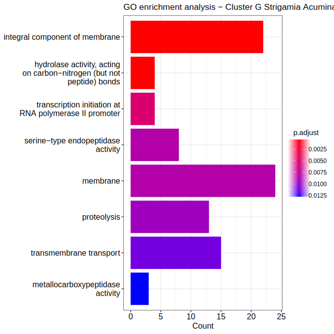

---
---
---

# Material and methods

## GO enrichment for non-model species

The following packages were used in R 4.2.3: clusterProfiler 2.6.2, readr 2.1.5, stringr 1.5.1, dplyr 1.1.4, GO.db 3.16.0, ggplot2 3.5.1, cowplot 1.1.3

The annotated genomic data for *Strigamia Acuminata*, as well as gene clusters to be analysed can be found here:

    # gene data
    /enadisk/gstock/MetaInvert/martin/strigamia-acuminata.b2g.reformated.annot

    # cluster data
    /enadisk/maison/schoenstein/stage24/results/gene_clusterA.txt
    /enadisk/maison/schoenstein/stage24/results/gene_clusterB.txt
    /enadisk/maison/schoenstein/stage24/results/gene_clusterC.txt
    /enadisk/maison/schoenstein/stage24/results/gene_clusterC1.txt
    /enadisk/maison/schoenstein/stage24/results/gene_clusterC2.txt
    /enadisk/maison/schoenstein/stage24/results/gene_clusterD.txt
    /enadisk/maison/schoenstein/stage24/results/gene_clusterE.txt
    /enadisk/maison/schoenstein/stage24/results/gene_clusterF.txt
    /enadisk/maison/schoenstein/stage24/results/gene_clusterG.txt

The GO enrichment script can be found here:

    /enadisk/maison/morlon/stage/script/clusterprofiler_go_enrichment_analysis.R

The first part of the script loads all necessary libraries:

```{r}
library(clusterProfiler) 
library(readr)
library(stringr)
library(dplyr)
library(GO.db)
library(ggplot2)
library(cowplot)
```

Then, we build a TERM2GENE data frame with col1=GO_ID and col2=GENE:

```{r}
# Define genome genes path
genome_path <- "/enadisk/maison/morlon/stage/data/raw/strigamia-acuminata.b2g.reformated.annot"

# Parse lines into list of vectors
parsed_lines <- lapply(read_lines(genome_path), function(line) {
  split_line <- strsplit(line, "\t")[[1]]
  if (length(split_line) == 2) {
    # If only 2 columns, add an empty string for the third column
    return(c(split_line, ""))
  } else {
    return(split_line)
  }
})

# Convert the list of vectors to a data frame, with no description
TERM2GENE <- do.call(rbind, parsed_lines) %>%
  as.data.frame(stringsAsFactors = FALSE) %>% 
  dplyr::select(c(1,2)) %>%                             # no description column
  filter(str_detect(V1, "^strigamia")) %>%              # only lines w/ strigamia genes
  filter(str_detect(V2, "GO:")) %>%                     # only lines beginning w/ GO terms
  relocate(V2, .before = V1)                    
colnames(TERM2GENE) <- c("GO_ID", "GENE")               # Annotate data frame
```

From the previous table, we build a TERM2NAME data frame with col1=GO_ID and col2=GO_TERM, using GO.db to associate each go term to its ID:

```{r}
# Create function to associate GO_TERM to GO_ID in a TERM2GENE table, careful to return NA if no TERM found
get_go_term_safe <- function(go_id) {
  go_term <- tryCatch({
    term <- GOTERM[[go_id]]
    if (is.null(term)) return(NA)  # Return NA if GO ID not found
    Term(term)
  }, error = function(e) {
    NA  # Return NA on error
  })
  return(go_term)
}

# create TERM2NAME dataframe
TERM2NAME <- transform(TERM2GENE, GO_TERM = sapply(GO_ID, get_go_term_safe)) %>% 
  dplyr::select(c(1,3))
```

From the cluster list of interest, we build a vector of gene id to be used in the enrichment:

```{r}
# Define path
cluster_path <- "/enadisk/maison/morlon/stage_martin/stage24/results/gene_clusterH.txt"   

# Create list 
cluster_genes <- grep("strigamia-acuminata", read_lines(cluster_path), value = TRUE)

cluster_genes <- gsub("[\\\\\"]", "", cluster_genes)  #delete residual " and / characters
```

The enricher() function of the clusterProfiler package is then ran to do the analysis. Here, the p-value limit was set to 0.05, the The Benjamini-Hochberg procedure was used as p-value adjustment, the minimal and maximal size of genes annotated for testing was set to 1 and 1000 respectively:

```{r}
enrich_result <- enricher(gene = cluster_genes,
                          TERM2GENE = TERM2GENE,
                          TERM2NAME = TERM2NAME,
                          pvalueCutoff = 0.05,
                          pAdjustMethod = "BH",
                          minGSSize = 1,
                          maxGSSize = 1000) 
saveRDS(enrich_result, file = "/enadisk/maison/morlon/stage/results/go_enrichment_analysis/GO_analysis_strigamia_acuminata_cluster_H.rds")

# Draw plot & save it
pdf("/enadisk/maison/morlon/stage/results/go_enrichment_analysis/GO_analysis_strigamia_acuminata_cluster_H.pdf")
barplot(enrich_result) + ggtitle("GO enrichment analysis - Cluster H Strigamia Acuminata")
dev.off()
```

Result per cluster is saved as a pdf (for easy viewing), svg (for integration in .md for example) and as a .rds (in-depth results).

# Results

## Heatmap with annoted clusters (Stage Martin)


## Cluster A

{width="300"}

The A cluster is comprised of highly conserved genes.

Thus gene linked to essential go_terms have a high count (over represented) and show significant enrichment.

## Cluster B

{width="300"}

The B cluster is comprised of highly conserved genes expect for diplopoda.

The analysis displays high count of terms linked to protein (de)phosphorylation, and significant enrichment for those terms as well as for the IV complex of the mitochondrial respiratory chain. This could be explained by the activity of diplopoda in soil nutrient cycles which could be associated with specific metabolism chain.

## Cluster C

{width="300"}

see cluster C1 and C2 (divided)

## Cluster C1

{width="300"}

The C1 cluster is comprised of genes mostly absent of hexapoda, crustacea, chilecerata and most insects, however, theses are present in diplopoda.

The analysis displays high count and significant enrichment of terms linked to oxidoreductase activity, monooxygenase activity, and iron/heme binding. Once again, this could be due to the metabolism of diplopoda and *Strigamia Acuminata* which is linked to soil nutrient cycles.

## Cluster C2

{width="300"}

The C2 cluster is comprised of genes mostly absent of hexapoda, crustacea, chilecerata and most insects, and also diplopoda.

The analysis displays high count and significant enrichment for the methyltranferase activity term, this surrepresentation could be due to species-specific natural product methyltransferases (NPMTs) that have specific functions particular to *Strigamia Acuminata*.

## Cluster D

NO SIGNIFICANT ENRICHMENT \~

## Cluster E

{width="300"}

The E cluster is comprised of highly conserved genes for arthropods expect for diplopoda and some nematoda.

Enrichment of term related to DNA transcription regulation, apoptosis, protein dimirixation and phosphorylation.

## Cluster F

{width="300"}

The F cluster is comprised of genes mostly absent of hexapoda, crustacea, chilecerata, diplopoda, and most insects.

Most significant enrichment terms are linked to GPRC activity/signaling pathway, inferring that *Strigamia acuminata* evolved specific CPRG genes. The same can be found for calcium ion binding genes.

## Cluster G

{width="300"}

The F cluster is comprised of genes highly conserved in diplopoda only.

Enrichment of term related to membrane composition, hydrolase activity, serite-type endopeptidase activity, proteolysis and membrane transport.

## Cluster H

{width="300"}

The H cluster is comprised of genes mostly specific to Strigamia Acuminata (and conserved in very foe chilopoda).

Enrichement of terms related to membrane transport/signaling receptor/transporters, sodium channel activity and chitin binding
